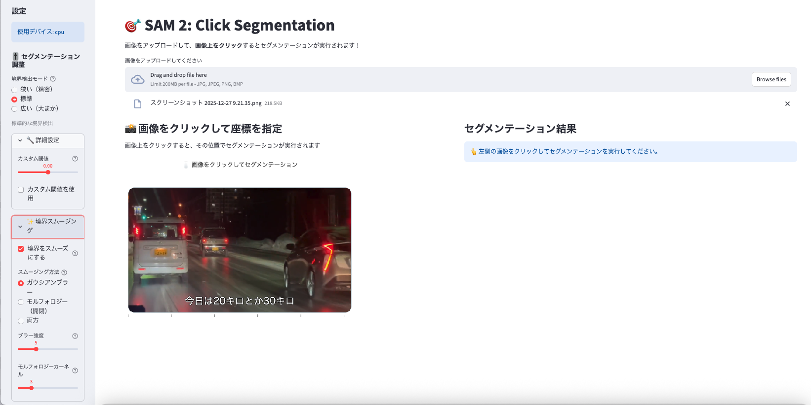

# SAM 2 Web UI

SAM 2（Segment Anything Model 2）を使用したインタラクティブな画像セグメンテーションWebアプリケーションです。


## 機能

- **インタラクティブセグメンテーション**: 画像をクリックするだけで即座にセグメンテーションを実行
- **複数の結果表示**: 最適な結果と他の候補を同時に表示
- **切り抜き画像のダウンロード**: セグメンテーション結果を透過PNG形式でダウンロード
- **境界検出モード**: 3段階（狭い/標準/広い）で境界の精度を調整
- **境界スムージング**: ガウシアンブラー、モルフォロジー処理で滑らかな境界を実現
- **カスタム閾値**: 詳細な閾値調整が可能
- **多言語対応**: 日本語と英語のUI切り替えに対応

## スクリーンショット



アプリケーションは2カラムレイアウトで構成されています：
- **左側**: 画像をクリックして座標を指定
- **右側**: セグメンテーション結果と切り抜き画像を表示

## インストール方法

### 1. リポジトリをクローン

```bash
git clone https://github.com/tomorrow56/sam2-webui.git
cd sam2-webui
```

### 2. 仮想環境を作成（推奨）

```bash
python -m venv venv
source venv/bin/activate  # Linux/Mac
# または
venv\Scripts\activate  # Windows
```

### 3. 依存関係をインストール

```bash
pip install -r requirements.txt
```

### 4. アプリケーションを起動

```bash
streamlit run sam2_webui.py --server.headless true
```

> **注意**: 初回起動時にメールアドレスの入力を求められる場合がありますが、Enterキーを押してスキップできます。`--server.headless true` オプションを使用すると、この質問を回避できます。

## 使用方法

1. ブラウザで `http://localhost:8501` にアクセス
2. サイドバーから画像をアップロード（JPG, PNG, BMP対応）
3. 左側の画像をクリックしてセグメンテーションを実行
4. 右側に結果が表示される
5. 「切り抜き画像をダウンロード」ボタンで結果を保存

### サイドバー設定

#### 🎚️ セグメンテーション調整
- **狭い（精密）**: オブジェクトの境界を精密に検出
- **標準**: 標準的な境界検出
- **広い（大まか）**: オブジェクトを広めに検出

#### 🔧 詳細設定
- **カスタム閾値**: -2.0〜2.0の範囲で細かく調整

#### ✨ 境界スムージング
- **ガウシアンブラー**: マスクの境界をぼかして滑らかに
- **モルフォロジー（開閉）**: 小さなノイズ除去と穴埋め
- **両方**: 両方の処理を適用（最も滑らか）

## ファイル構成

```
sam2-webui/
├── sam2_webui.py         # メインアプリケーション
├── requirements.txt      # 依存関係
├── translations.py       # 多言語対応（日本語/英語）
├── README.md            # 日本語ドキュメント
├── README_EN.md         # 英語ドキュメント
├── LICENSE              # MITライセンス
├── checkpoints/         # モデルファイル（自動ダウンロード）
└── img/                 # 画像ファイル（スクリーンショット等）
```

## システム要件

- **Python**: 3.8以上
- **GPU**: CUDA対応GPU（推奨）またはCPU
- **RAM**: 8GB以上（Largeモデルの場合は16GB以上推奨）

## モデル

初回起動時に以下のモデルが自動ダウンロードされます：

| モデル | サイズ | 特徴 |
|--------|--------|------|
| sam2.1_hiera_small | ~150MB | 高速、軽量 |
| sam2.1_hiera_base_plus | ~300MB | バランス型 |
| sam2.1_hiera_large | ~800MB | 高精度 |

### モデルの変更方法

使用するモデルを変更するには、`sam2_webui.py` の以下の部分を修正します：

```python
# sam2_webui.py の 126行目付近
def download_model():
    model_name = "sam2.1_hiera_small.pt"  # ←ここを変更
    model_path = f"checkpoints/{model_name}"
    
    # ...（中略）...
    
    # sam2_webui.py の 148行目付近
    sam2_model = build_sam2("configs/sam2.1/sam2.1_hiera_s.yaml", model_path, device=device)  # ←ここも変更
```

#### 設定例：

**smallモデル（デフォルト）**
```python
model_name = "sam2.1_hiera_small.pt"
sam2_model = build_sam2("configs/sam2.1/sam2.1_hiera_s.yaml", model_path, device=device)
```

**base_plusモデル**
```python
model_name = "sam2.1_hiera_base_plus.pt"
sam2_model = build_sam2("configs/sam2.1/sam2.1_hiera_b+.yaml", model_path, device=device)
```

**largeモデル**
```python
model_name = "sam2.1_hiera_large.pt"
sam2_model = build_sam2("configs/sam2.1/sam2.1_hiera_l.yaml", model_path, device=device)
```

変更後、アプリを再起動すると新しいモデルがダウンロードされます。

## 依存関係

- streamlit >= 1.28.0
- torch >= 2.0.0
- torchvision >= 0.15.0
- opencv-python >= 4.8.0
- numpy >= 1.24.0
- pillow >= 10.0.0
- matplotlib >= 3.7.0
- plotly >= 5.0.0
- streamlit-plotly-events >= 0.0.6
- [SAM 2](https://github.com/facebookresearch/sam2)

## 注意事項

- 初回起動時にモデルのダウンロードが行われます（数分かかる場合があります）
- GPU環境でより高速に動作します
- 大きな画像は処理に時間がかかる場合があります

## ライセンス

MIT License

## 謝辞

- [Segment Anything Model 2 (SAM 2)](https://github.com/facebookresearch/sam2) - Meta AI Research
- [Streamlit](https://streamlit.io/) - Web UIフレームワーク
